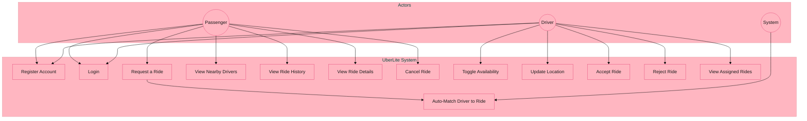
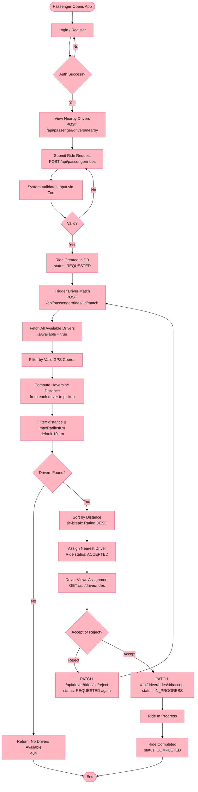
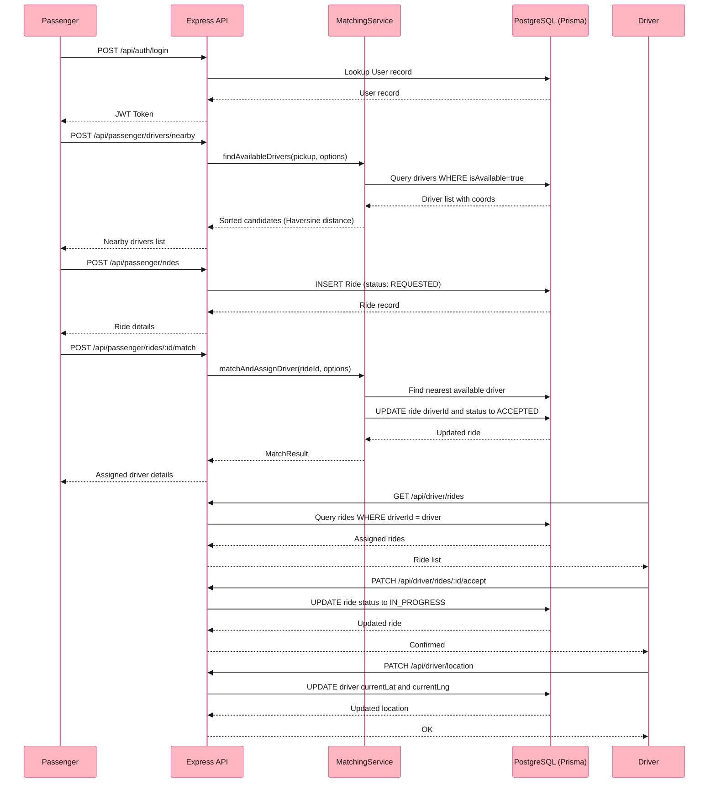
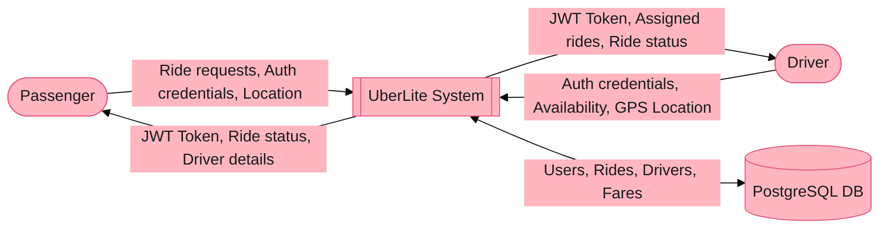
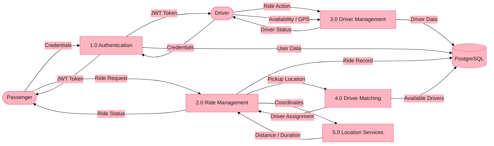
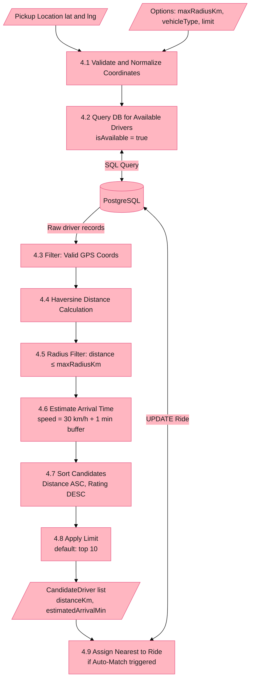

# UberLite 🚗

> **UCS503P — Software Engineering Project**
> A lightweight ride-hailing system built with React + TypeScript (frontend) and Node.js + Express + Prisma + PostgreSQL (backend).

**Team:**
- Ayush (1024030740)
- Anshika (1024030749)
- Gurleen Kaur (1024030325)

---

## Table of Contents

- [Project Overview](#project-overview)
- [Tech Stack](#tech-stack)
- [Analysis Phase](#analysis-phase)
  - [2.1 Use Cases](#21-use-cases)
  - [2.2 Activity & Swimlane Diagrams](#22-activity--swimlane-diagrams)
  - [2.3 Data Flow Diagrams](#23-data-flow-diagrams)
  - [2.5 User Stories](#25-user-stories)
- [Getting Started](#getting-started)

---

## Project Overview

UberLite is a simplified ride-hailing platform implementing core functionality:
- Passenger and Driver authentication (JWT)
- Real-time driver availability & GPS location management
- Haversine-based proximity driver matching
- Full ride lifecycle: Request → Match → Accept → In-Progress → Complete

---

## Tech Stack

| Layer | Technology |
|---|---|
| Frontend | React 19, TypeScript, Vite |
| Backend | Node.js, Express, TypeScript |
| ORM | Prisma |
| Database | PostgreSQL |
| Auth | JWT (jsonwebtoken), bcryptjs |
| Validation | Zod |
| Testing | Jest |

---

## Analysis Phase

### 2.1 Use Cases

#### 2.1.1 — Use-Case Diagram



#### 2.1.2 — Use Case Templates

**UC-01: Request a Ride**

| Field | Detail |
|---|---|
| **Use Case ID** | UC-01 |
| **Actor** | Passenger |
| **Precondition** | Passenger is authenticated (JWT token valid) |
| **Trigger** | Passenger submits pickup & drop-off address |
| **Main Flow** | 1. Passenger sends `POST /api/passenger/rides`. 2. System validates input via Zod. 3. Ride created in DB with status `REQUESTED`. 4. Ride details returned. |
| **Alternate Flow** | If coords missing, ride created with address strings only. |
| **Postcondition** | Ride record exists with status `REQUESTED`. |
| **Exception** | Invalid token → 401. Validation failure → 400. |

**UC-02: Auto-Match Nearest Driver**

| Field | Detail |
|---|---|
| **Use Case ID** | UC-02 |
| **Actor** | Passenger (triggers), System (executes) |
| **Precondition** | Ride exists with status `REQUESTED`. Available drivers exist with valid coords. |
| **Trigger** | `POST /api/passenger/rides/:id/match` |
| **Main Flow** | 1. Fetch all `isAvailable=true` drivers. 2. Filter by valid GPS. 3. Compute Haversine distance to pickup. 4. Filter by `maxRadiusKm` (default 10 km). 5. Sort: nearest first, tie-break by rating. 6. Assign nearest driver; status → `ACCEPTED`. |
| **Postcondition** | Ride assigned to driver; status = `ACCEPTED`. |
| **Exception** | No drivers in radius → 404. Ride already assigned → 409. |

**UC-03: Toggle Driver Availability**

| Field | Detail |
|---|---|
| **Use Case ID** | UC-03 |
| **Actor** | Driver |
| **Precondition** | Driver is authenticated. |
| **Trigger** | `PATCH /api/driver/availability` with `{ isAvailable: boolean }` |
| **Main Flow** | 1. Validate `isAvailable` via Zod. 2. Update `driver.isAvailable` in DB. 3. Return updated status. |
| **Postcondition** | Driver immediately visible/hidden in matching pool. |
| **Exception** | Invalid token → 401. Non-boolean → 400. |

---

### 2.2 Activity & Swimlane Diagrams

#### Activity Diagram — Full Ride Booking Flow



#### Swimlane Diagram — Ride Request Sequence



---

### 2.3 Data Flow Diagrams

#### 2.3.1 — DFD Level 0: Context Diagram



#### 2.3.2 — DFD Level 1


#### 2.3.3 — DFD Level 2: Driver Matching Process (4.0)



---

### 2.5 User Stories

| ID | As a… | I want to… | So that… | Priority |
|---|---|---|---|---|
| US-01 | Passenger | Register with email, name, and password | I can access the UberLite platform | High |
| US-02 | Driver | Register with vehicle details and license number | I can accept rides on the platform | High |
| US-03 | Passenger | Log in and receive a JWT token | I can make authenticated API calls | High |
| US-04 | Passenger | Request a ride by entering pickup and drop-off address | The system can arrange a driver for me | High |
| US-05 | Passenger | See a list of drivers near my pickup location | I know drivers are available before booking | High |
| US-06 | Passenger | Have the system automatically match me with the nearest driver | I don't have to manually select a driver | High |
| US-07 | Passenger | View my ride history and individual ride details | I can track my past trips | Medium |
| US-08 | Driver | Toggle my availability on/off | I only receive rides when I'm ready to drive | High |
| US-09 | Driver | Update my current GPS location | The system can accurately match me to nearby passengers | High |
| US-10 | Driver | Accept or reject a ride assigned to me | I have control over which rides I take | High |
| US-11 | Driver | View my assigned and completed rides | I can track my ride history | Medium |
| US-12 | System | Compute Haversine distance between two coordinates | Driver-passenger proximity is accurately calculated | High |
| US-13 | System | Estimate travel arrival time | Passengers get an ETA for their matched driver | Medium |

---

## Getting Started

### Prerequisites
- Node.js 18+
- PostgreSQL
- npm

### Backend

```bash
cd code/backend
npm install
cp .env.example .env   # fill in DATABASE_URL and JWT_SECRET
npx prisma migrate dev
npm run dev
```

### Frontend

```bash
cd code/frontend
npm install
npm run dev
```

### Run Tests

```bash
cd code/backend
npm test
```
